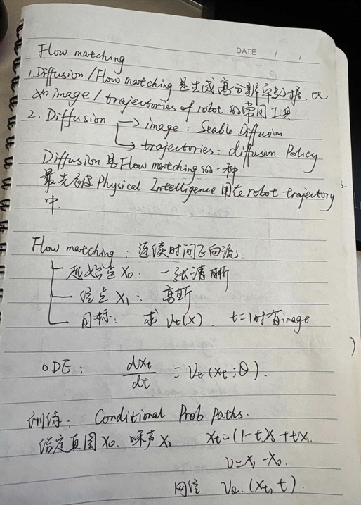
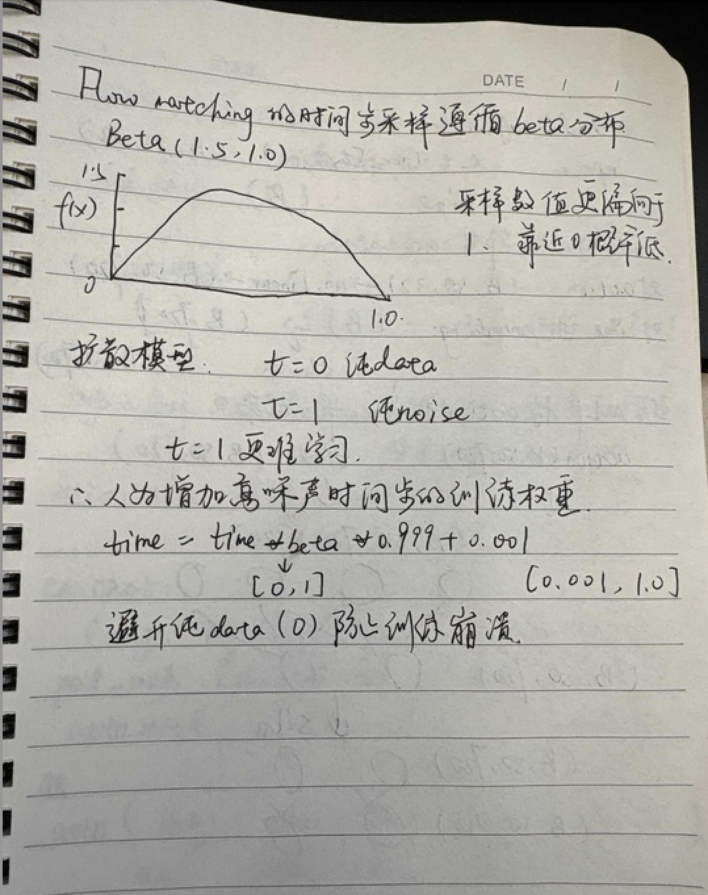
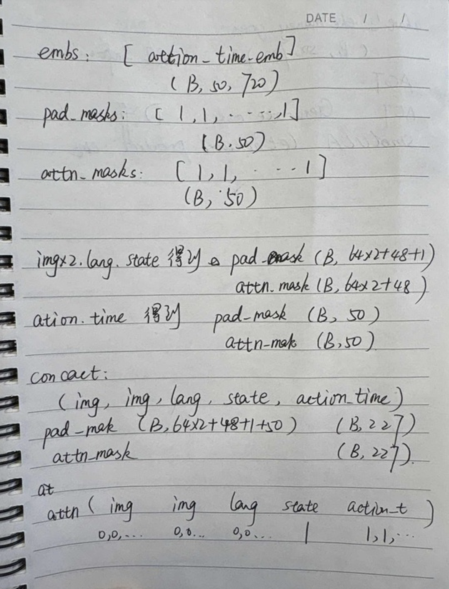
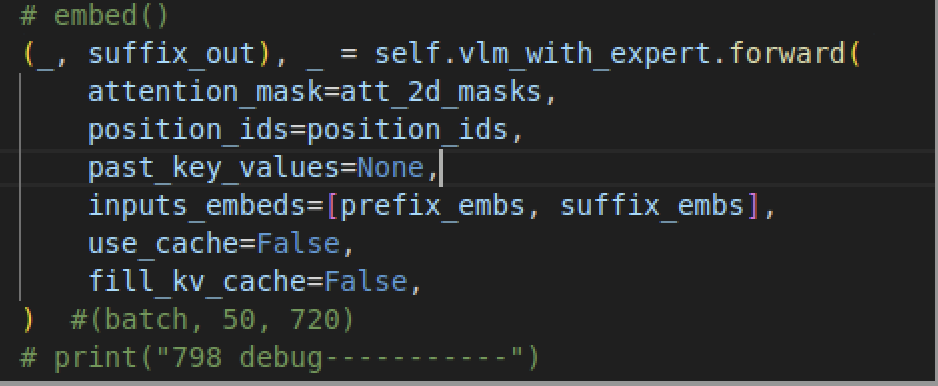
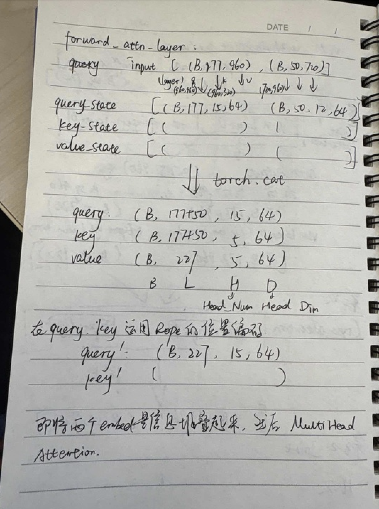
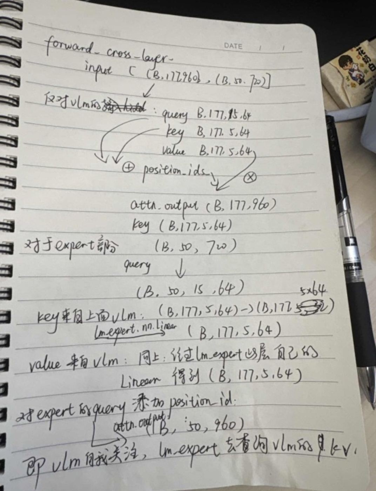

 

论文：https://www.alphaxiv.org/zh/overview/2506.01844

### smolVLA主要架构

    [Paper]()
    
    Designed by Hugging Face.
    ┌──────────────────────────────┐
    │                 actions      │
    │                    ▲         │
    │ ┌─────────┐      ┌─|────┐    │
    │ |         │────► │      │    │
    │ |         │ kv   │      │    │
    │ |         │────► │Action│    │
    │ |   VLM   │cache │Expert│    |
    │ │         │────► |      │    │
    │ │         │      │      │    │
    │ └▲──▲───▲─┘      └───▲──┘    |
    │  │  |   |            │       |
    │  |  |   |          noise     │
    │  │  │ state                  │
    │  │ language tokens           │
    │  image(s)                    │
    └──────────────────────────────┘

- 对输入进行的处理：

  - Images:[(Batch, C,512,512), (Batch, C,512,512)] (两路相机)
  - Img_masks:([B],[B]) (image级别的mask，不同机器人配置的相机个数不一样，为了统一对齐格式)
  - Lang_tokens:(Batch, lang_len=48)
  - Lang_masks:(Batch, 48)
  - State:(Batch, state_dim=32) 实验中机器人关节dim=6，其余的是padding
  - Actions:(Batch,chunk_size=50,action_dim=32)
  - Noise:(Batch,chunk_size=50,noise_dim=action_dim=32)

- 对输入进行处理

  - 第一步：多模态融合(embed_prefix)

    - 对每张images(Batch,C=3,H=512,W=512),vit的结构中14x14是一个patch,则图像的sequence长度是L=(512/14)x(512/14)=32x32=1024,提取经过vlm模型的vision_model的last_hidden_state得到(Batch, Len=1024,D=hidden_dim=768)
    - 经过vlm结构的connector(把图像特征对齐到跟语言空间一致)最终是(Batch,64,960)
    - 对文本进行处理：
      - Lang_tokens:(Batch,48) -> Embedding ->(Batch,48,960)
      - State;(Batch,32)->nn.Linear()->(Batch,960)->unsqueezed:(Batch,1,960)
    - 输出拼接：
      - Embs:[image_embed,    image_embed,     lang_embed,     state_embed]
      - Pad_masks:[1,1,...(B,64),    1,1,1...(B,64),    1/0...(B,48),        1(B,1) ]
      - Attn_masks:[0,0,...(64),       0,0,...(64),         0,0,0,...(48),         1]

    ------

    

  - 第二步：融合action和time(embed_suffix)

    - Flow Matching原理

      

    - 根据flow matching的原理：

      - 输入actions:(batch, chunk_size=50, action_dim=32),  

        输入noise:(batch, 50,32)

        Time:(B) -> (B,1,1)

      - 则x_t = noise + (1-time)*actions, 速度u_t = noise-actions

      - 这里注意对noise采样是正态分布随机采样，但是对时间t采取的是beta分布：

      

      

      > [!CAUTION]
      >
      > 那我们如何将time信息和noise_action很好的fuse在一起，这是个problem, 我们来看embed_suffix是如何做的。

    - 对noised_action:(Batch,chunk_size=50,action_dim=32)->nn.Linear()->(batch, chunk_size=50,720)

    - 对time:(B)->sin_cos的方法对(0,1)区间的时间数值进行编码->(Batch,720)->repeat->(Batch,50,720)

    - 用mlp(Linear->Silu->Linear->Silu) 将action和time结合起来, 最后得到noised_actions_with_time:(batch, 50,720),    pad_masks:[1,1,1...] (B,50),     attn_masks:[1,1,1,...] (B,50)

      ------

      

  - 最后把所有的输入信息concate在一起

    - [img,      img,     lang,     state,    noised_action_with_time]

    - Pad_masks: (B, 64x2+48+1+50).  -> (B,227)

    - Attn_masks: (B, 64x2+48+1+50).  -> (B,227)

      

      ------

      

  - 第三步： VLM_with_expert的推理

    - 首先，总体来看通过vlm_with_expert的推理会得到一个(batch,50,720)的tensor->nn.Linear(720,32=padded action dim)->得到估计的v_t
    - 和上面的u_t真值做mse_loss
    - 所以这一步的关键其实是看VLM_with_expert是怎么把这些信息做整合的

    

------

- 输入:

  - Inputs_embeds:[prefix_embes,    suffix_embs]
  - Prefix_embs:[img,    img,    lang,    state] (Batch,64+64+48+1,960)
  - Suffix_embeds: [noised_actions]. (B,50,720)

- VLM_with_Expert的网络结构

  - [vlm.text_model,     lm_expert(transformer decoder结构)]。分别有16层；是一个典型的“大模型带小模型”的结构。并且这两个网络结构的层数是一样的，在每一层都进行特征融合。

  - 16层计算

    - 对于奇数层，采取的是joint attention,代码里的方法是forward_attn_layer(把vlm每次的hidden state和expert每次的hidden state拼接在一起，作为一个统一的长序列，在同一个注意力机制下相互观察)
    - 对于偶数层采取的是cross_attention,代码里的方法是forward_cross_attn_layer(互相查询方式的观察)
    - 每一层的观察得到attn_output:(batch, 177+50, 960)
    - 然后分开使用各自网络这一层的linear, norm, mlp层回到各自hidden state的维度，vlm是（Batch,177,960), expert是（Batch,50,720) (虽然attn_out_dim=960,但是expert可以通过自己层的proj回到720的维度)

  - 接下来可以关注一下奇数层的joint_attention(self_attention)和偶数层的cross_attention具体是如何实现的。

    - Self_attention: 即将两个hidden state tensor堆叠起来，然后运行multihead attntion计算，互相观察。

      

    - Cross_attention

      
