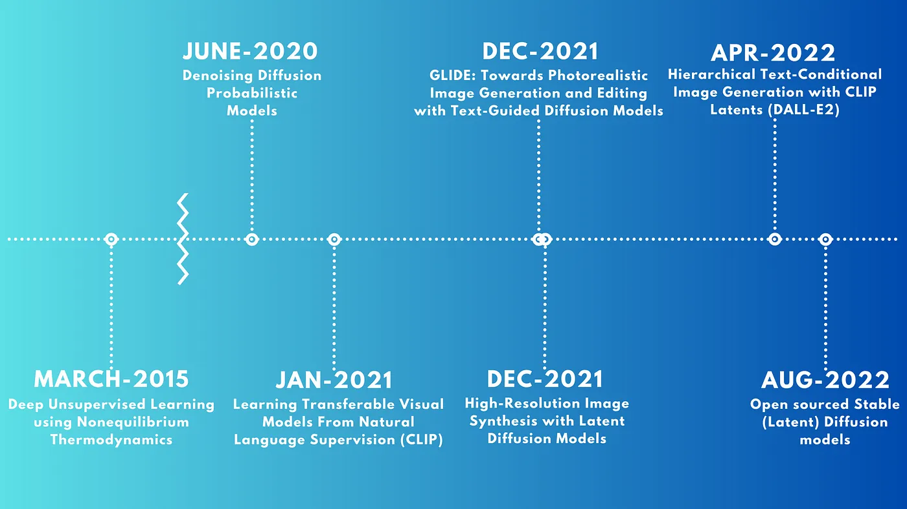
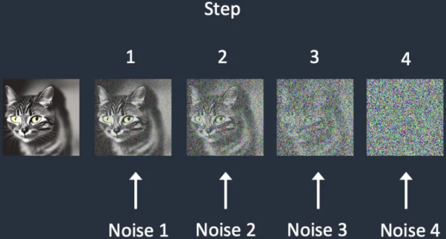
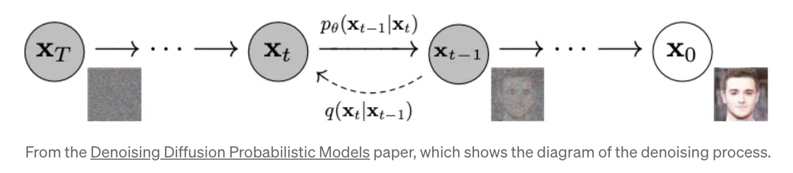
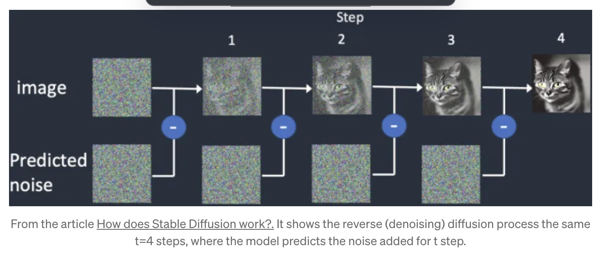
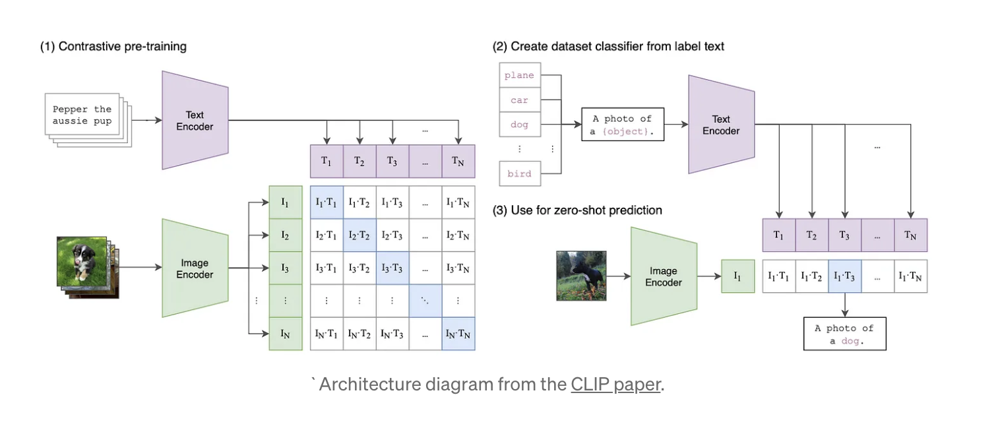
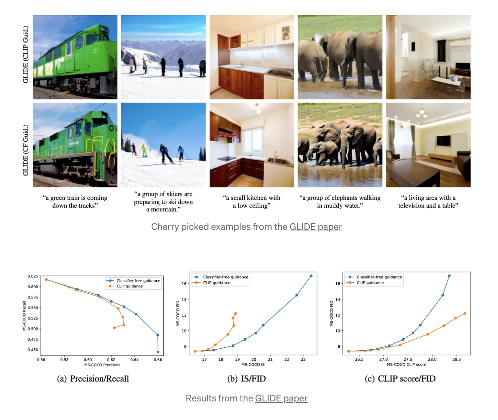
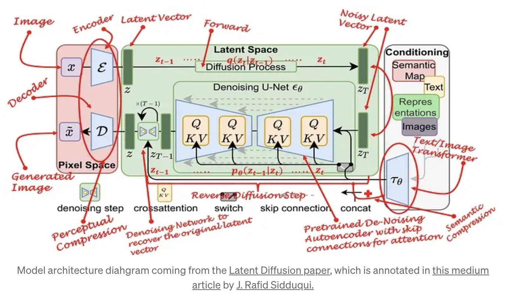
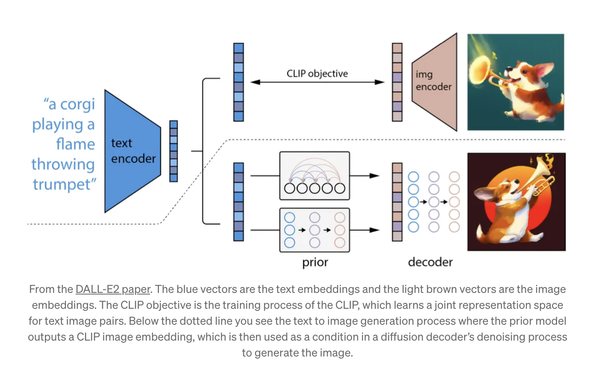
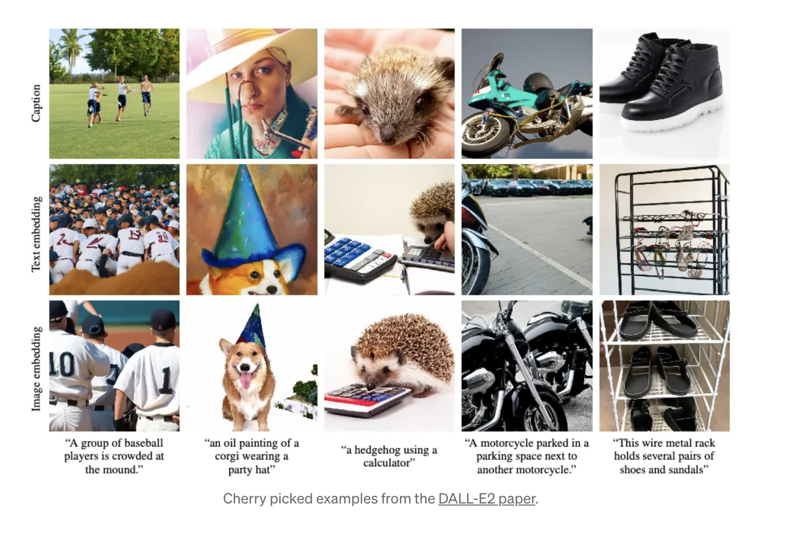

### 第一篇文章-2015

关于diffusion的第一篇文章来自于 [Deep Unsupervised Learning using Nonequilibrium Thermodynamics](https://arxiv.org/abs/1503.03585) paper published in 2015. 受到非平衡统计物理的启发，引入了一个模型，将数据的结构破坏成t steps。这个过程叫做forward diffusion;在此之后恢复叫做reverse diffusion

这个前向的diffusion过程来自于马尔可夫链，就是t时刻的结果只与t-1时刻的结果相关。

然后是逆像的diffusion过程，通过gan预测每一步的分布。

### 图像生成再次引入diffusion-2020

[Denoising Diffusion Probabilistic Models](https://arxiv.org/abs/2006.11239) from 2020这篇文章取得了让人印象深刻的效果

他们证实了reparameterization的技巧可以用在reverse diffusion的过程中形成封闭的解决方案。

并且发现预测每一步的噪音而不是噪音背后的图像得到更好的结果。在CIFAR10数据集上进行了测试，在IS和FID得分中都取得了sota.

重新引入diffusion为后面的midjourney和stable diffusion都打下了基础。

### CLIP

OpenAi 发布了他们的论文 [Learning Transferable Visual Models From Natural Language Supervision](https://arxiv.org/abs/2103.00020) and a [blog post](https://openai.com/research/clip)和 开源的多模态的zero-shot CLIP模型。

这个模型在语言的监督下学习了视觉的特征，这不是一个新概念，但是它将text prompt匹配图像做的很好。

它们抓取了互联网的超过400百万张图片，他们发现将text prompt适配到每个任务更好，相比传统的分类模型来说。比如传统的分类模型打的标签就是类别dog，但是在text prompt里面就是a photo of dog。

它们的预训练包括：

- 基于transformer的text encoder

- 基于vision transformer的image encoder

- 基于resnet的image encoder

输出的向量text encoder:Ti和Image encoder Ii 然后用在它们下一步的对比预训练过程中。

输入是

- 一个prompt用于描述图像中的物体，如a photo of big {object}

- 包含该物体的图像
- 

text和image encoder输出的向量构成text-image对，构成一个矩阵

- 矩阵元素是一个image vector和text vector的乘积，*Ii \* Ti*.

- 矩阵对角元素是matching的text-image对

- 每行非对角元素是text和image不匹配对应的

模型目标是最大化对角线元素的值，最小化非对角线元素值。这个过程输出的是对比性表示，捕捉的是图片和文本shared的特征，因此叫_Contrastive Language-Image_ *Pre-training*.

这个模型输出的是image和text的embedding表示，这些embeddings可以通过cosine相似度或者欧几里得距离来衡量相似度，这些相似度可以用在很多任务中，比如GAN 模型中的判别器或图像分类器

# Guided Language to Image Diffusion for Generation and Editing (GLIDE)-2021年底

OPENAI发表论文_[GLIDE: Towards Photorealistic Image Generation and Editing with Text-Guided Diffusion Models](https://arxiv.org/abs/2112.10741)_. 运用了guided diffusion和comparing CLIP guidance vs *Classifier-free guidance,允许扩散模型从文本中学习。在diffusion层中使用__unet__结构。用到text-image的__数据集__，这个数据集在DALL-E中也被使用。*

##### Guided diffusion

使用transformer model去encode text prompt,将最后一层embedding的输出作为diffusion模型的class-conditioning，这个class-conditioning使用了attention去关注forward/backward/denising attention层。

##### Clip guidance

在推理过程中的去噪扩散过程中，使用clip进行分类起指导。用clip的点积对比矩阵梯度扰乱去噪均值，将初始去噪图像移动到 CLIP 预测高文本图像匹配的方向。类似于 Google 的 dreep deam 模型。

##### Classifier-free guidance

在训练过程中同时提供没有text guidance的example，在推理的去噪阶段，让模型预测两次噪声，一次有prompt一次没有。text guidance会影响预测的噪音值。有text的预测noise:(*εθ(xt|y)*),没有的(*εθ(xt|∅)*)。文本造成的不同在每个时间步t会乘以一个系数s,然后加到预测的噪音上。这样推着噪音预测向正确的方向进行。因为我们在每一步都考虑了更多文本特定的噪声，从而增强了文本添加的噪声效果。

# *εˆθ(xt|y) = εθ(xt|∅) + s · (εθ(xt|y) − εθ(xt|∅))*

结果发现classfier-free guidance比clip guidance效果更好

最后他们训练diffusion用的256x256，因为扩散过程是其运行的像素空间中非常密集的过程。因此他们也训练了一个encoder和decoder用于降采样和复原图片到1024x1024。

### Latent diffusion-2021年底

论文 the _[High-Resolution Image Synthesis with Latent Diffusion Models](https://arxiv.org/abs/2112.10752)__， 主要将diffusion过程从像素空间移到了latent space，使得diffusion过程更加的高效_

Latent Diffusion 模型首先训练autoEncoder模型，encoder提取与原图最相似最重要的部分到latent space， decoder基于latent空间的表示生成原图。然后，将unet中的扩散过程用在pretrained auto encoder编码器的latent space representation.他们也发现classifier-free guidance提升质量。

UNet 还使用交叉注意力层，允许它们用作不同类型的条件输入生成器，例如文本到图像和超分辨率。

autoencoder的decoder层把latent space上采样恢复到1024x1024.

### DALL-E2-2022年初

OpenAI发布论文 _[Hierarchical Text-Conditional Image Generation with CLIP Latents](https://arxiv.org/abs/2204.06125)__，这是一个__继承__工作来自于clip, dall-e和glide.本文的作者确实将该模型称为 unclip，因为该模型将 CLIP 模型中的文本嵌入转换回图像。_

可以注意到虚线下方，prior model输出一个clip image embedding，然后用于diffusion decoder的去噪过程中的condition.

1. take一个预训练好的clip模型，冻结权重

1. 将prompt通过clip encode成一个embedding向量

1. 一个基于扩散的prior model将text embedding 匹配到相应的clip image embedding.所以prior model产生clip model会产生的图像。

1. 使用调整过的glide模型，他们通过去噪/反向扩散过程以随机方式映射图像嵌入。这使得模型能够生成许多与相似视觉概念相关的可能图像。

为什么要用prior去产生image embedding

比起单纯的caption或者text embedding，prior产生的image embedding能产生更好的结果，如上图。

但是openai没有开源模型的权重。

### 开源的latent diffusion(stable diffusion)-2022

开源模型stable diffusion由Stability AI发布

https://medium.com/@vasco-dev/history-and-literature-on-latent-stable-diffusion-dbca69fd54d5
