# 风格

AIGC领域中的一项重要子任务就是对图像进行风格化处理，**一般涉及到对图像视觉外观和纹理进行编辑（被视为风格信息），同时保留其底层对象、结构和概念不变（被视为是内容信息）**。为了达到这种编辑效果，就需要实现对图像中风格和内容进行分离。现有的方法通常需要训练专门的分离模型或者需要进行大量的优化，使用成本较高。

查看相关paper的网址：

https://www.paperdigest.org/article/?id=style_transfer

### 2024/10/19南京航空航天大学《DiffuseST:Unleashing the Capability of the Diffusion Model for Style Transfer》

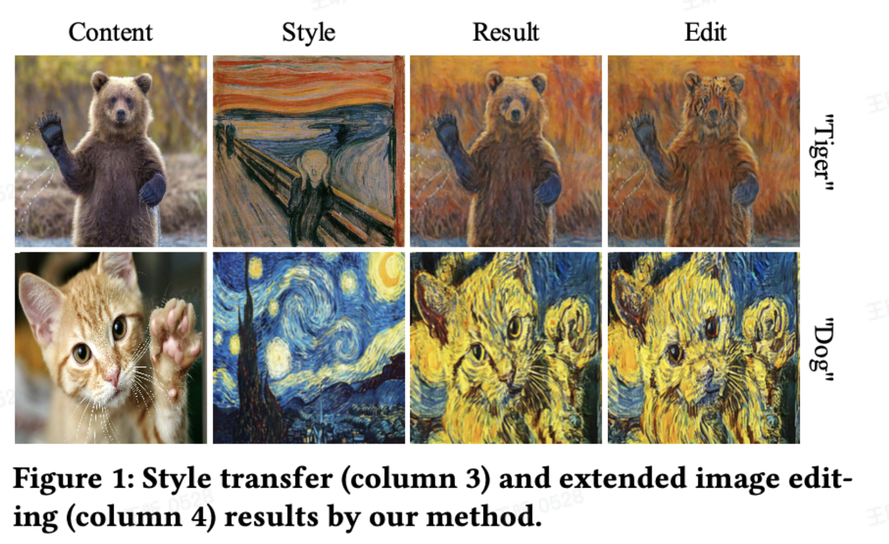

提出了一种training-free的风格转移方法，balancing文本，图像style和图像content的特征结合起来。具体方法：

对于一张内容图像Ic,和一张风格图像Is

a.使用BLIP Diffusion中的BLIP-2的encoder产生Is的text-aligned embedding的表示。

b.为了提取空间特征，在DDIM inverse的过程中content和style分支保留U-net的feature

c.在diffusion模型的step-by-step过程中分离content和style的注入。

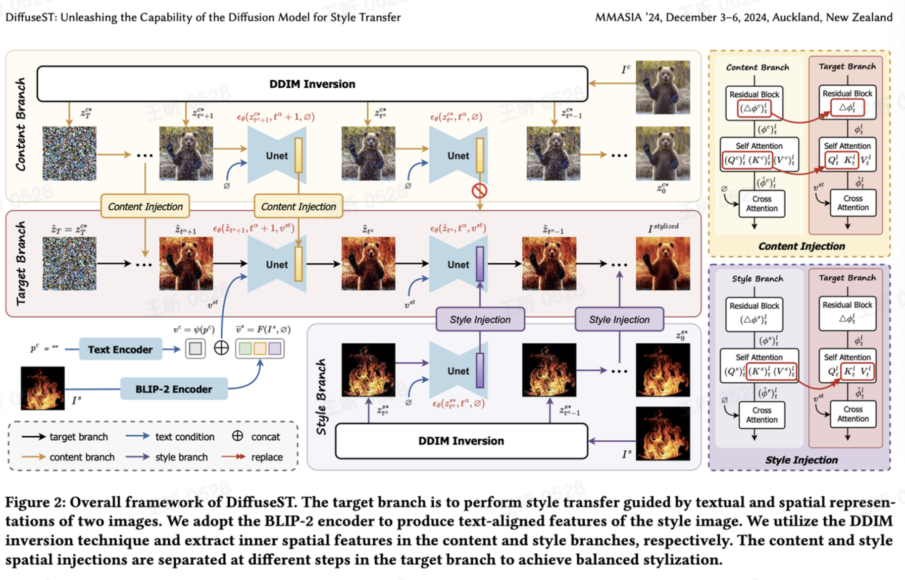

### Text representation extraction

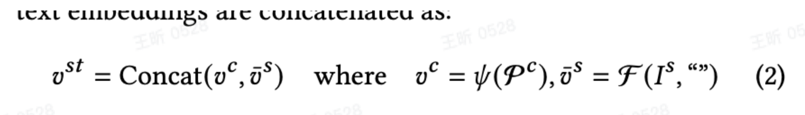

风格的特征很难用text描述，而image features又很少作为sd模型的condition input.

因此，先采用Blip-diffusion里的blip-2 encoder将style image的特征表示为文本表示。此外，我们用clip的到content image的embedding信息。

### Spatial representation extraction

用DDIM算法提取图像特征。每一层u-net有一个残差块，一个self-attention模块去加强特征表示，一个cross-attention模块和text condition交互。关注前两个blocks，调查发现主要保持图像空间的语义和结构特征。

#### content和style的injection

用相应注入层unet的两层参数替换到target branch.

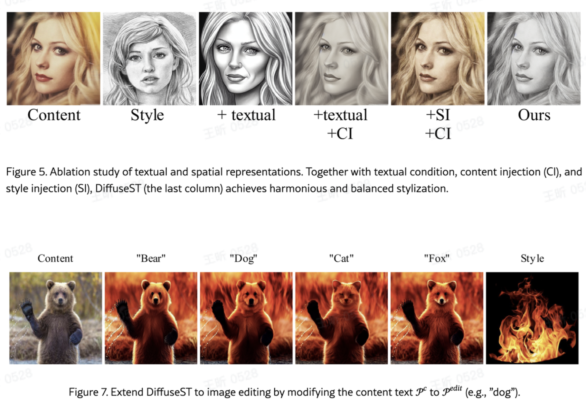

### 《Implicit Style-Content Separation using B-LoRA》

#### 主要工作：

将LoRA(低秩适应)机制引入到图像编辑领域，提出了一种称为B-LoRA的框架，该框架可以隐式分离单个图像中的风格和内容组件，同时继承了LoRA的各种优势，包括轻量化训练和即插即用等功能。此外，作者通过深度分析现有流行扩散模型（Stable Diffusion XL, SDXL）的内部架构，发现仅需要联合设置两个B-LoRA块即可以实现图像内容和风格的分离，从而显著的提升各种下游图像风格化任务的性能和效果。

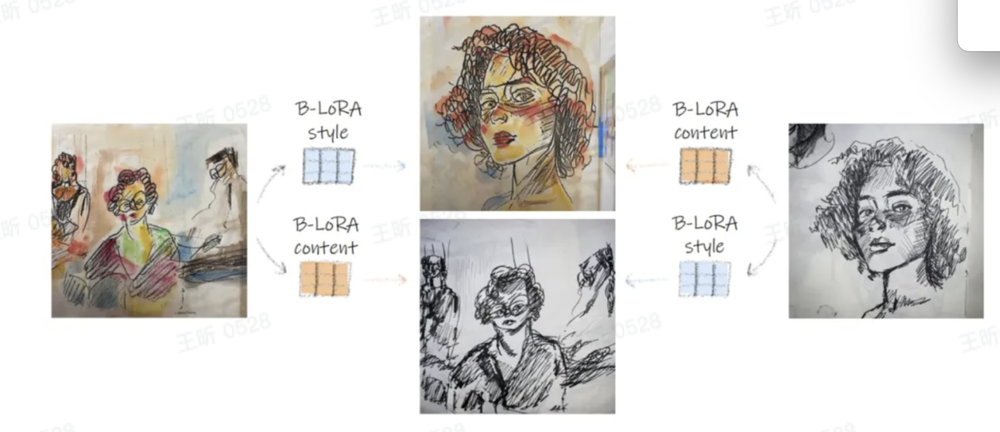

提出了一种称为B-LoRA的风格转换框架，如上图所示，由于B-LoRA继承了原始LoRA的优势，具有高度的任务灵活性，同时不容易出现过拟合（仅优化模型注意层中新加入的低秩权重，预训练模型的参数保持冻结）。**通过对SDXL内部结构进行分析，作者发现仅需要对两个特定的transformer层设置B-LoRA块就可以实现对图像内容和风格的分离**。

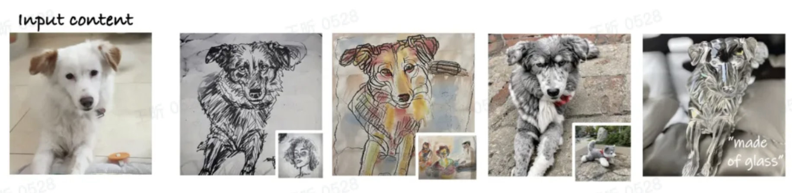

B-LoRA的另一个优点是即插即用的灵活性，它可以作为单独的组件应用到各种下游图像编辑任务中，而不需要任何额外的训练或微调。例如上图展示的风格迁移、文本引导的风格操作和条件图像生成等任务。

#### 方法：

##### 对sdxl结构分析

sdxl是一个基于扩散的文本到图像生成模型，其主干网络采用了一个大型unet架构，由70个注意力层组成，这些注意力层可以被分成11个transformer块，前两个和最后三个块分别包含4个和6个注意力层，中间6个块各包含10个注意力层，细节如下图所示。

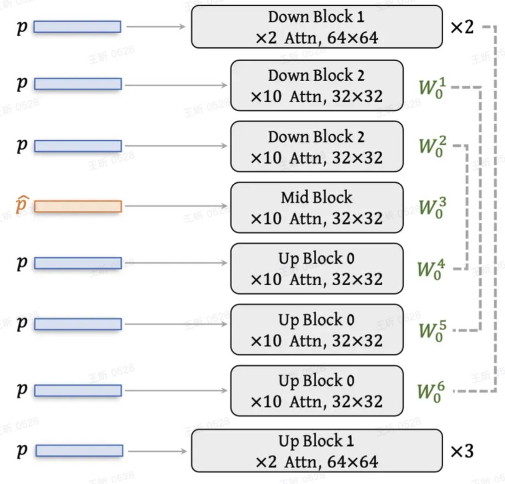

SDXL可以接受文本作为条件进行生成，具体来说，给定文本提示，首先使用OpenClip ViT-bigG和CLIP ViT-L两个模型对其进行编码，然后将两个编码拼接起来作为最终的文本条件，随后将通过交叉注意力层馈入到网络中。由于本文的目标是将输入图像的风格和内容解耦为单独的信号再进行处理，因而需要对sdxl每个层对生成图像的风格或内容的贡献进行判定。

判定方法非常简单，即将不同的文本提示注入到每个sdxl transformer块的交叉注意力层中，随后计算这些提示与生成图像之间的语义相似度。当只改变第i个块对应的输入提示时，如果观察到生成图像的变化较为明显，则表明该块对图像质量变化占主导地位。在实际操作时，作者重点检查了sdxl的6个中间transformer块，并且定义了两组随机的文本提示content和style,其中前者通过修改对象类别来定义内容，后者通过修改颜色来定义风格，然后使用CLIP来计算生成图像的变化程度。对于一对提示px,p，作者通过将变化提示px的嵌入注入到i块中，同时将原始p的嵌入注入到其它层中来生成新图像。对6个transformer块均执行后可以得到6幅图像，可以计算得到每一对提示的变化相似度得分：

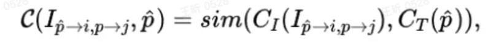

作者总共挑选了400对内容和风格提示进行了实验，实验结果表明sdxl模型中的第2，4个transformer块对生成内容的影响最大，而第5个块对生成风格的影响最大，如下图所示：

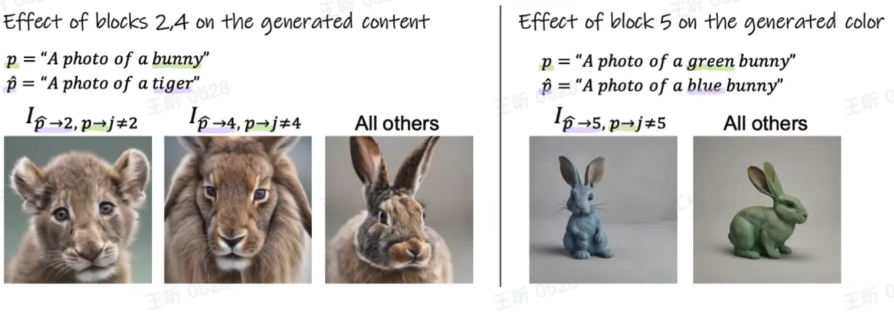

#### 基于lora的内容和风格分离

基于上述发现，作者认为仅需要对第2，4和第5个块进行优化就可以实现隐层特征的解耦，而无需对整体模型微调。作者引入了Lora模块[1]来对这两部分进行单独优化，另w0表示预训练sdxl模型的冻结权重，令delta{w_i}表示每个块的低秩适应矩阵，优化过程主要分为两部分，第一部分优化delta{w_2}delta{w_5}，第二部分优化delta{w_4}delta{w_5}。

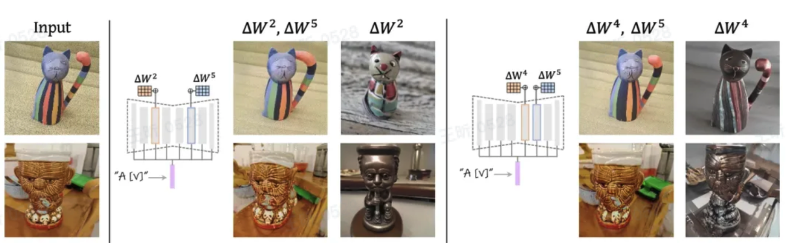

优化过程和生成结果如上图所示，可以看出，delta{w_2}delta{w_4}更倾向于控制图像中内容信息，且delta{w_4}可以更好的捕捉到图像中的细节信息。作者将这种解耦方式称为B-LoRA,因为其只对两个Transformer块进行了Lora微调，这样可以节省70%的显存占用。

#### B-lora的风格化操作

在实验图像内容和风格的解耦后，作者重点对delta{w_4}和delta{w_5}两层进行微调，其中delta{w_4}捕获内容，delta{w_5}捕获风格，通过微调他们的参数来实现图像的风格化操作，整体过程如下图所示：

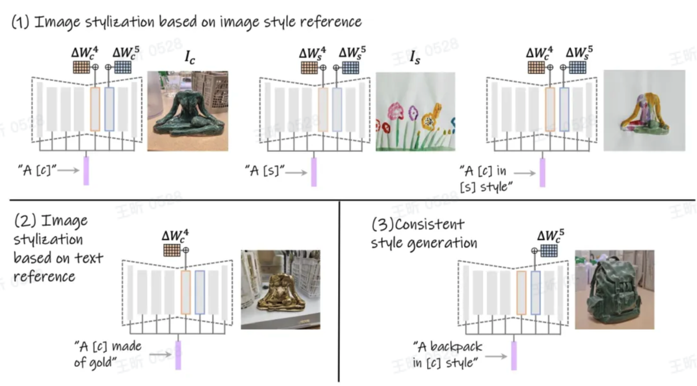

给定一个内容图像Ic和一个风格图像Is,分别学习它们对应的B-LoRA权重delta{w_4}和delta{w_5}.然后将这两个B-LoRA权重组合到预训练的sdxl模型中，就可以将Ic的内容与Is的风格进行融合，来生成一个新的风格化图像（如上图1所示）。为了实现文本为条件的图像风格化效果（如上图2所示），只要使用内容图像Ic对应的B-LoRA权重delta{w_4},将其与用户输入的文本提示进行融合就可以实现对图像风格的编辑，这样可以很好的保留Ic的内容特征。此外还可以通过排除delta{w_4}仅使用delta{w_5}的方式来调整模型仅关注图像Is中的特定风格，这样允许用户通过输入不同的文本来单独控制生成内容（如上图3所示）。

#### 效果：

（1）图像风格迁移：给定一个内容图像和一个风格图像，通过组合两个B-LoRA的权重实现风格迁移。

（2）基于文本的图像风格编辑：仅使用内容图像的B-LoRA权重，加上文本提示实现对图像风格的编辑。

（3）一致的风格生成：使用风格图像的B-LoRA权重，生成具有相同风格的新图像。

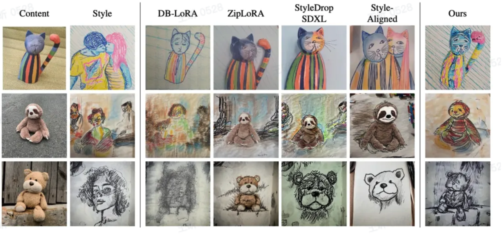

其中前两行展示了图像风格迁移的效果，即要求模型迁移style图像中的风格，同时保留content图像中的内容。可以看到，本文的方法相比其他方法更加稳定。此外，第三行图像展示了基于文本的图像风格编辑的效果，可以看到本文方法对输入对象的内容进行了良好的保留。

#### 限制：

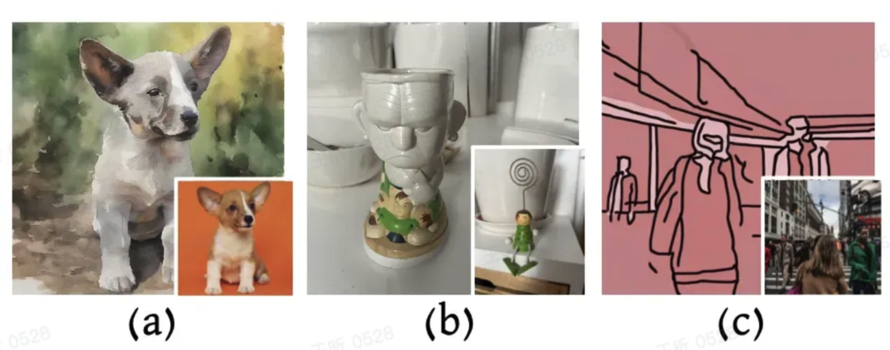

对一些风格和内容紧密结合的图像来说，风格信息对目标身份起到了决定性作用，因此当对这种图像中的内容进行风格化处理时，很容易丢失目标的身份信息，如上图(a)(b)所示。此外，B-LoRA在面对一些复杂场景时也会出现难以准确捕获场景结构的情况，如上图(c)所示。作者表明这些局限性可以通过进一步探索LoRA解耦的属性来解决，例如在解耦时考虑更加细粒度的结构、形状、颜色、纹理等属性。

### 《Harnessing the latent Diffusion Model for Training-Free Image Style Transfer》

先看一下效果：

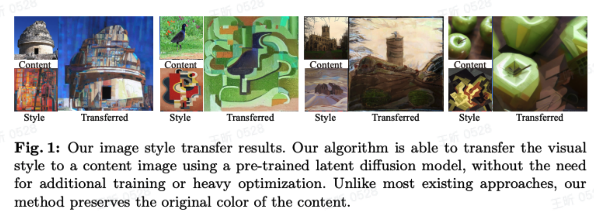

在unet做风格迁移时代，方法是finetune模型，计算量很大；作者借鉴了当时做style transfer的一种方法，AdaIn;但是直接用到现在的diffusion model里面受限于channels的数量而不能有很好的效果。作者提出了一种STRDP的算法，变化了LDM的去噪过程，将AdaIN用一种不同的方式重复应用到lantent diffusion model的unet结构里。这个算法是training-free的，而且可以保留原图的颜色。

#### Related work

- Direct Image Optimization:基于vgg features设计style和content的loss,优化像素值。
- Image Feature Transformation:将一个content图像和一个image图像提取特征，然后在content features里面添加style feature最后做个decode AdaIN的方法。主要就是将风格数据转移到图像特征当中。也提出了一种网络结构，将图像特征的均值和方差替换掉content特征的均值和方差。
- Diffusion Models:
  - 重点是可控制性
  - Guidance:guided diffusion得到一个提供的梯度作为去噪过程中的指导。需要附加的模型和额外的训练。
  - Additive control:Controlnet包含了一份克隆的diffusion model和新的finuetune的参数。用额外的输入比如line arts,depth去finetune这些新参数。
  - Tuning.通过fine-tune提供预训练LDM的可控制性。比如有的方法优化text embedding包含style信息。

### 背景知识

- Diffusion Models:将数据x加噪到高斯，去噪过程让网络预测噪声从而恢复数据x
- Latent Diffusion Models:LDM将数据x映射到latent space中对应z，从而降低计算量。这种表示方法也有一个问题，传统的给diffusion model加控制的方法，如果不经过额外的训练，无法直接用到LDM中。
- Adaptive Instance Normalization:
- 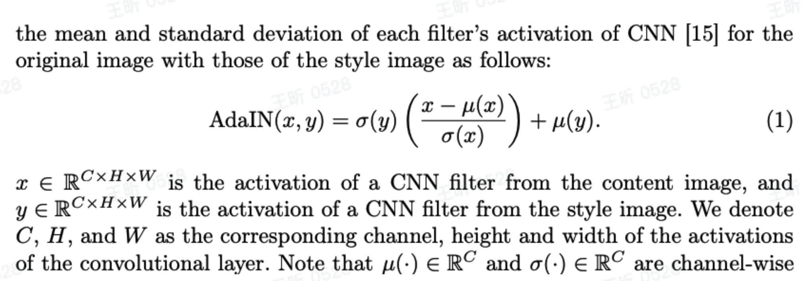

仿照之前的AdaIn的方法，在提取过程中用风格的均值和方差替换content feature的均值和方差，按照上面的公式，这个框架的缺陷就是要重新训练一个decoder去将输出转换为image.

#### 我们的方法

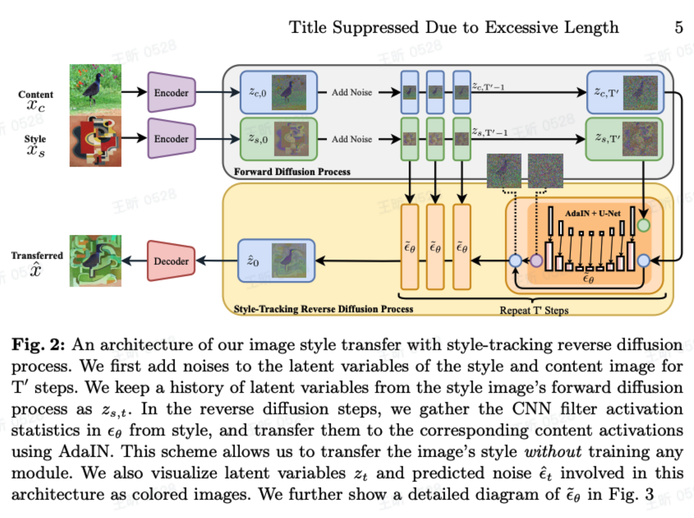

方法：

首先style image和content image都会被转换到latent space,然后都会经过前向的diffusion process,通过加噪产生一系列的noisy latent representations.再反向的diffusion过程中，不断运用AdaIN集成style和content的隐变量。

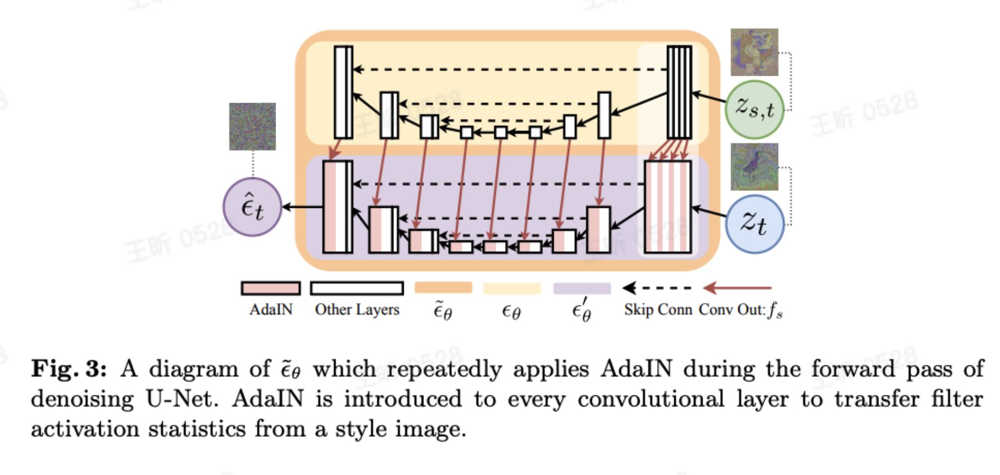

对降噪过程中u-net的参数执行AdaIn算法。

> [!NOTE]
>
> 均值和方差可以很大程度的影响风格转换效果，那么我想改变一张图片的风格，如果先对其进行去风格化，再进行风格嵌入，效果是不是会出奇的好呢？

AdaIN全称为Adaptive Instance Normalization,是一种图像处理技术，用于实现风格迁移。它的计算公式如下：

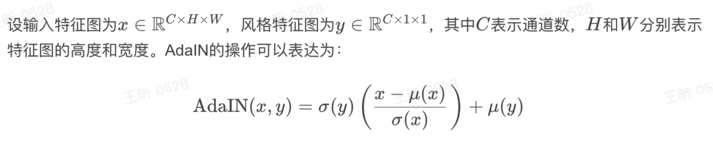

#### 对比效果

保留了原图的颜色

##### 参数控制：

S参数来控制在应用style transfer之前我们对原始的content和noise加多少噪声。如果S=1，原图像加噪成高斯噪声，是无法重构出原图的。因此我们要控制好s的值。

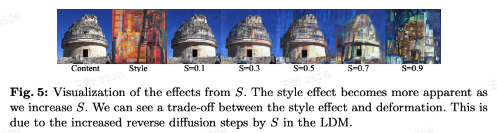
