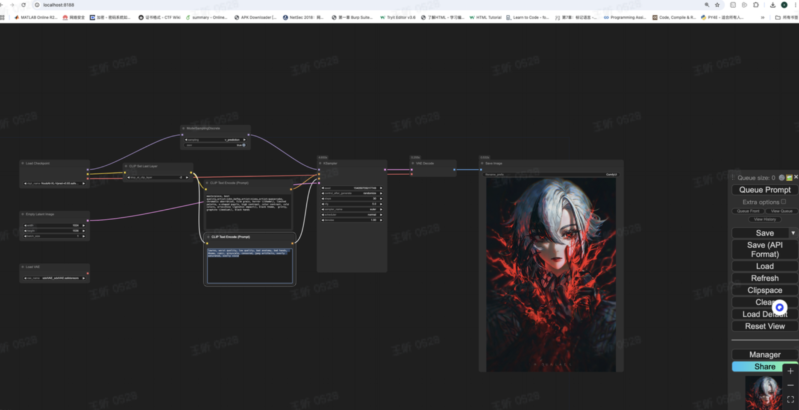
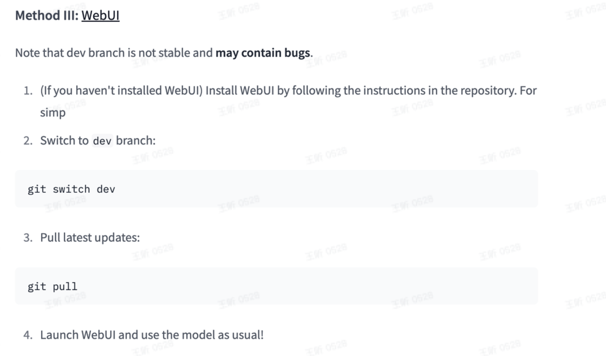
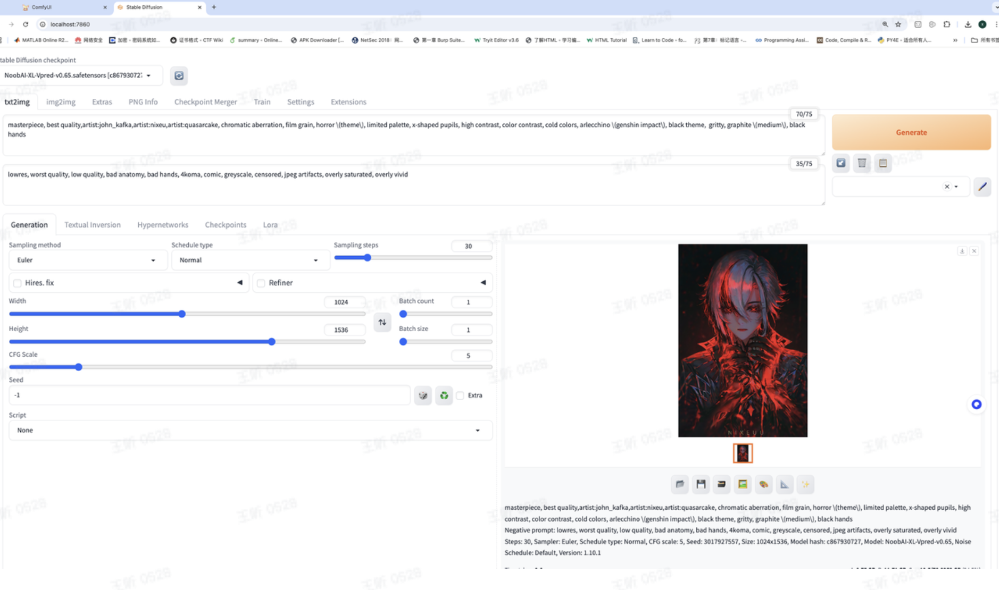
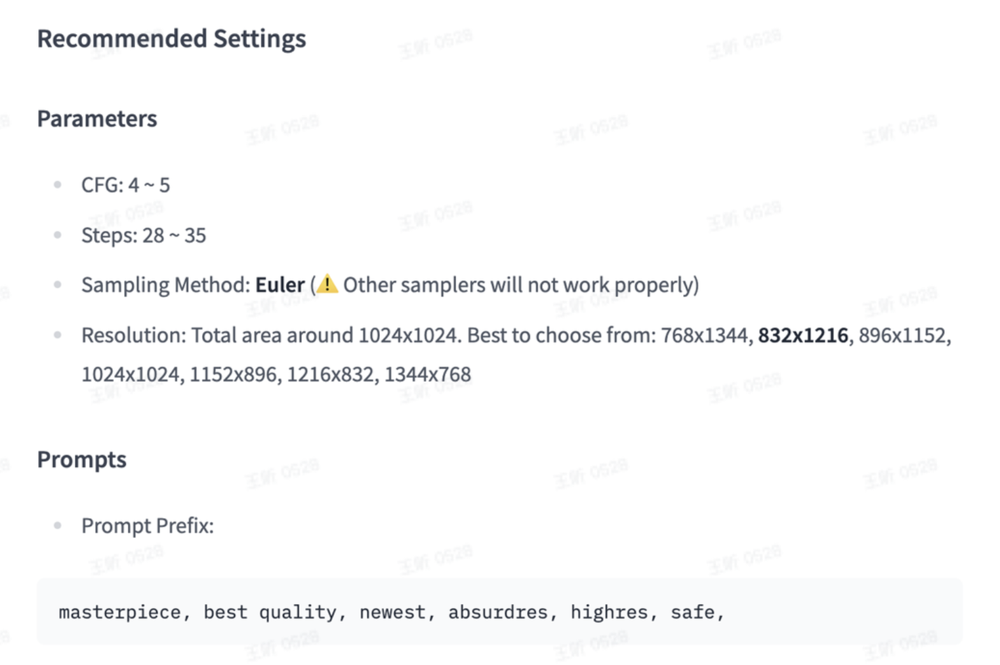

## 1. comfyui工作流加载

需要增加节点，直接使用官方提供的工作流即可。

## 2.webui运行

根据https://huggingface.co/Laxhar/noob_sdxl_v_pred_test（一个月以前的说明文档），无法在webui里运行。

根据https://huggingface.co/Laxhar/noobai-XL-Vpred-0.65s?not-for-all-audiences=true

## 3.lora脚本训练

将parameterization=1 --v_parameterization --zero_terminal_snr --scale_v_pred_loss_like_noise_pred --debiased_estimation_loss \

在https://civitai.com/models/833294/noobai-xl-nai-xl 下面找到分享提示要将noise相关的都让之不生效 包括offset_noise之类的。
