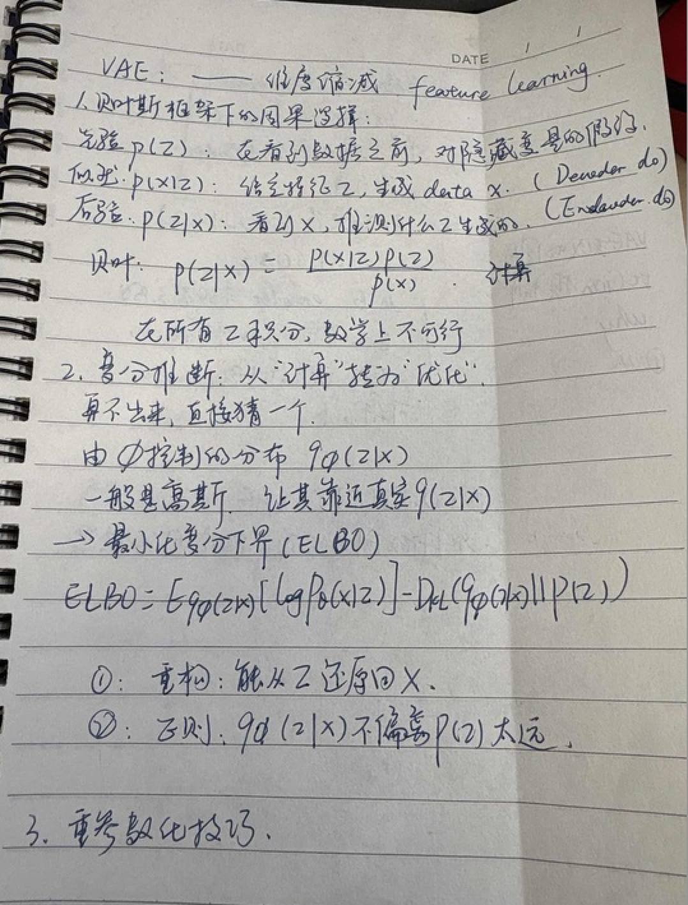
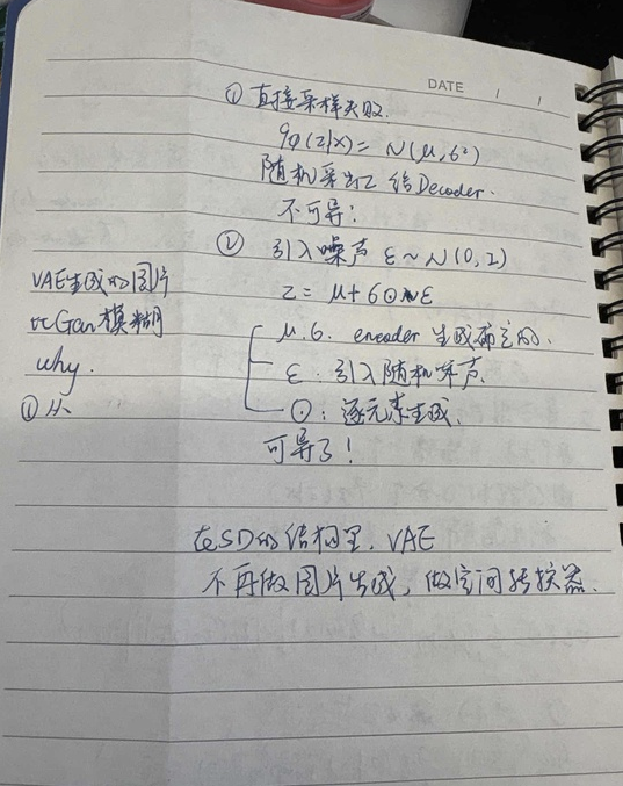

### vae是什么

VAE由三部分组成，VAE encoder, latent space, vae decoder
vae encoder将原始的数据信息X进行编码映射到latent space空间中，latent space是代表训练数据的一个隐式空间，从中进行采样得到采样数据Z'，最终通过VAE DECODER的解码过程可以把数据恢复X'

### 贝叶斯框架下的因果推断

### 重参数化技巧

