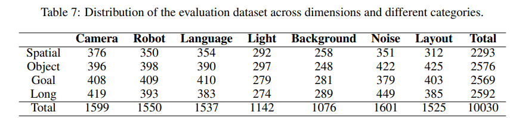
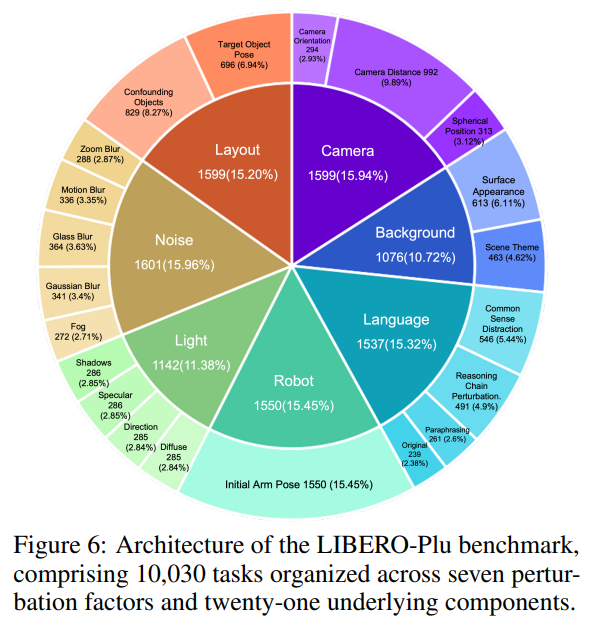
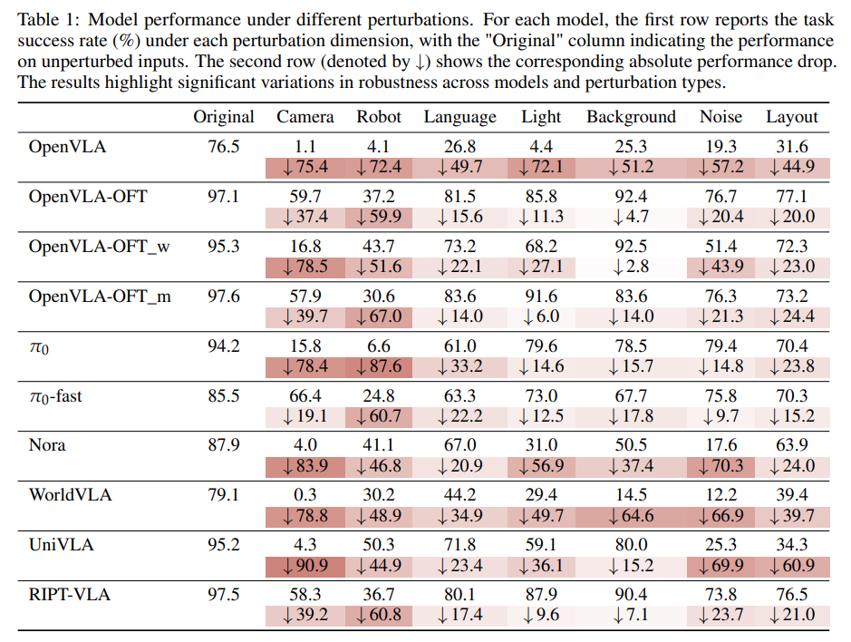
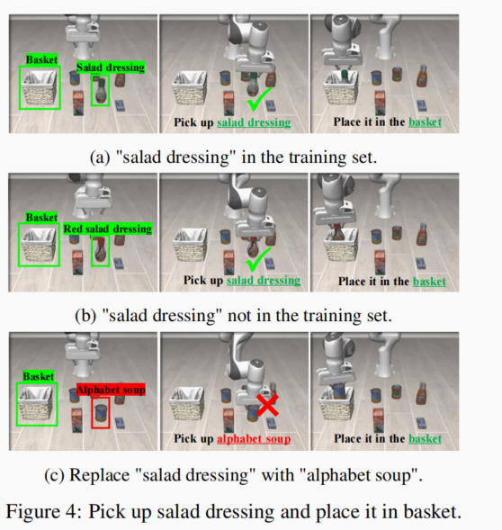
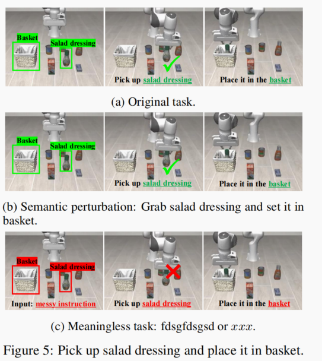
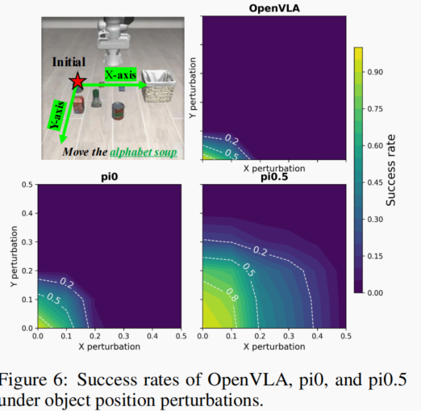
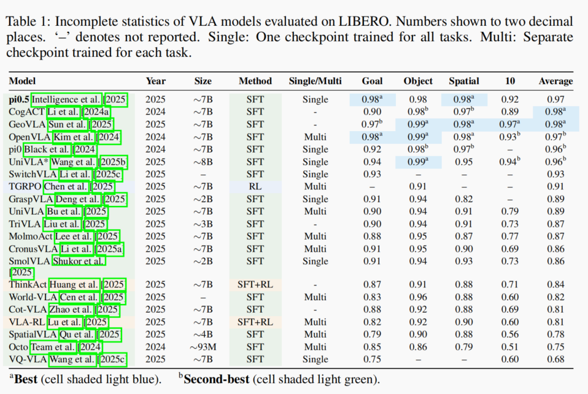

下面是来自medium的一篇文章的几乎翻译

> [!NOTE]
>
> 1.目前的vla本质还是数据采样模仿学习，因此环境条件、物体状态等一变准确率就急速下降；与此相对应的腕部相机表现强劲，因为腕部相机更能克服干扰。要提高泛化就得堆数据。
>
> 2.lang token在其中几乎不起到语义理解作用，language变化和指令变化几乎不影响动作行为。vla没有语言和现实机器人操作对应起来的理解能力。
>
> https://www.alphaxiv.org/zh/overview/2510.03827
>
> https://www.alphaxiv.org/zh/overview/2510.13626
>
> 3.要提高准确率都得微调。

vla的几种方案：

- [自回归方法：将机器人动作离散化为标记，并在大规模演示（如Openvla](https://arxiv.org/abs/2406.09246)和[Tinyvla）](https://ieeexplore.ieee.org/abstract/document/10900471/)上训练端到端策略；
- 基于扩散的模型：通过生成式扩散专家（例如 pi 序列）生成连续轨迹（https://www.pi.website/blog）
- 强化学习方法：超越监督式微调，例如[Vla-rl](https://arxiv.org/abs/2505.18719)。

然而，这些训练好的VLA模型仅在非常熟悉的场景和环境中展现出一定的性能，缺乏真正的泛化能力。VLA模型的迁移性非常低，同时我们也注意到，现有的基准测试缺乏对分布变化下模型性能的全面评估，这凸显了在多样化条件下进行系统、细粒度鲁棒性评估的必要性。

最近，我偶然发现了一篇名为 LIBERO-plus 的论文，它通过系统性的参数变化和各种扰动维度，对当前的 VLA 模型进行了详细的脆弱性分析，深入剖析了模型在不同条件下的性能。如果您感兴趣，请访问[https://sylvestf.github.io/LIBERO-plus/查看更多详情。](https://sylvestf.github.io/LIBERO-plus/)

这项工作并非创建更多任务，而是主要集中于引入扰动因子，以研究不同的扰动因子如何影响 VLA 的性能，并将其应用于测试案例/阶段：

## 扰动因子：

- **对象布局**：添加混淆对象（随机向任务场景中添加 n 个额外的未见对象）和/或改变目标对象的位置（x、y、z）和方向（俯仰、偏航、滚动）。
- **背景纹理**：改变环境的场景纹理（例如，从彩绘墙到砖墙），并随机改变工作表面的纹理（例如，桌面或地板）。
- **光照条件**：改变光照强度、方向、颜色和阴影图案，以影响场景风格。
- **相机视角**：改变第三人称相机的视角/姿态和视野——改变相机距离、球形位置和相机方向。
- **机器人初始状态**：改变机械臂的初始关节位置（qpos）。
- **语言说明**：重写任务说明，以增加语言的丰富性和复杂性，例如重写为更长、更口语化的形式，其中包含额外的但与任务无关的上下文线索，或涉及推理的复杂性。
- **传感器噪声：**注入光度失真，以评估在输入质量下降的情况下的鲁棒性，包括运动模糊、高斯模糊、变焦模糊、玻璃模糊以及雾霾。

上述扰动是通过修改场景 XML 定义文件或修改任务描述文件 (BDDL) 来实现的。

## 已测试的VLA模型概述

- **OpenVLA（Kim 等，2024）和 OpenVLA-OFTs（Kim 等，2025）**：该系列 VLA 基于 Prismatic-7B VLM 构建——VLM 是一个由 SigLIP 和 DINOv2 组成的视觉编码器，其输出与 Llama2-7B 语言骨干的输入空间融合，该语言骨干通过交叉注意力机制整合视觉和文本输入。为了使 VLM 骨干适应机器人控制，连续的机器人动作被离散化为每个维度 256 个区间，并以标记的形式表示在 LLM 词汇表中。Llama 分词器中最不常用的 256 个标记被替换为动作标记，训练过程采用应用于动作序列的标准下一个标记预测目标（因此训练损失为交叉熵）。OpenVLA 在 Open X-Embodiment (OpenX) 数据集上进行了预训练。
- **π0（Black 等人）和 π0-fast（Pertsch 等人，2025）**：核心模型包含一个用于语义理解多模态输入（多张 RGB 图像、语言指令和本体感觉状态）的 VLM 基类（PaliGemma），并将动作标记投影并路由到一个更小的动作专家模型。该框架类似于 Transfusion 框架，后者使用多个目标函数训练单个 Transformer：连续输出标记使用流匹配损失，离散标记使用交叉熵损失。
- **Nora（Hung et al., 2025）**：它采用Qwen-2.5-VL-3B多模态模型作为骨干网络，该模型具有强大的视觉语义理解能力。它使用FAST+分词器将连续的动作标记离散化，从而输出离散的动作序列。此外，它还在Open X-Embodiment数据集上进行了预训练。
- **WorldVLA（Cen等人，2025）：**一种自回归动作-世界模型，它将视觉-语言-动作建模和世界建模统一到一个集成框架中。其核心思想是联合学习用于动作生成的策略模型和用于未来状态预测的世界模型，从而使这两个组件能够相互增强。该模型基于Chameleon初始化，Chameleon是一个统一的图像理解和生成模型。它采用了三个分词器：一个基于VQ-GAN的图像分词器、一个基于BPE的文本分词器，以及一个动作分词器，该动作分词器将连续机器人动作的每个维度离散化为256个区间。所有模态（文本、图像、动作）都被离散化为词元，并在统一的序列中进行自回归建模。在训练过程中，动作建模数据训练模型，使其能够根据语言指令和图像观测历史生成动作块，损失函数仅基于动作词元计算。世界建模数据用于训练模型，使其能够根据当前图像和动作预测下一帧图像，损失函数仅基于
  图像标记计算。这种联合训练策略鼓励学习共享表征：世界模型获取环境物理信息以辅助生成与任务相关的动作，而动作模型则增强视觉理解以支持准确的帧预测。
- **UniVLA（Li等人，2025）：**该架构基于预训练的Prismatic-7B VLM模型构建。其关键创新在于扩展了LLM的词汇表，引入了特殊的动作标记来表示量化的潜在动作。该模型以视觉观察和语言指令作为输入，并自回归地预测一系列潜在动作标记。
- **RIPT-VLA（Brohan 等人，2022）：**其基础模型为 OpenVLA-OFT。这项工作通过添加一个轻量级的辅助头来增强模型，该辅助头用于预测动作分布的尺度参数 σθ，使其与强化学习 (RL) 兼容。在标准的预训练和监督微调 (SFT) 阶段之后，它引入了强化交互式后训练 (RIPT) 的第三阶段。该策略的核心是动态采样留一法后训练优化 (LOOP) 框架——一种动态拒绝机制，它过滤掉所有 K 次展开都获得相同奖励（全部成功或全部失败）的上下文样本，从而确保训练批次包含有意义的学习信号。

## 基准建设

[LIBERO](https://libero-project.github.io/main.html)最初包含 40 个评估任务，分为四个泛化子任务（空间、物体、目标、长距离）。这项工作为每个子任务生成了 500 个实例，涵盖七个扰动维度，因此总共有 500 * 4 * 7 = 14,000 个任务。之后，为了避免天花板效应，我们移除了所有模型或绝大多数模型都能解决的任务。然后，作者进一步平衡了剩余任务在各个增强子维度上的分布，以防止偏差。最终的测试基准数据集包含 10,030 个任务，涵盖所有七个维度。

按回车键或点击查看完整尺寸的图片

## 结果

研究结果共同揭示了当前甚大阵列（VLA）泛化能力的显著缺陷。如图所示，即使是微小的扰动也会导致性能急剧下降。

按回车键或点击查看完整尺寸的图片

- 发现 1：在各种输入扰动下，性能会显著下降，尤其是在相机视角和机器人初始状态发生变化时。
- 发现2：模型最容易受到相机视角和机器人初始状态变化的影响，这需要对空间几何和本体感觉有较高的理解水平。相比之下，模型对光照和背景变化表现出相对的适应能力，因为这些变化属于更表面、更低层次的视觉变化。
- 发现 3：语言扰动导致大多数模型的平均性能下降幅度第二小（-25.3），这表明模型可能比预期的更少依赖语言指令，并可能利用视觉环境中的任务线索。
- 发现 4：与仅依赖第三人称视角的模型（例如 OpenVLA-OFT_w）相比，采用第一人称腕部摄像头的模型（例如 OpenVLA-OFT）展现出更优异的泛化能力，尤其是在应对摄像头视角变化时。此外，强调多样性和协同训练的训练策略（例如 π0,π0-fast）能够持续产生在多种扰动类型下都更稳健的模型，这凸显了接触不同数据分布的重要性。
- 发现 5：虽然模型表现出能够忽略干扰物体的能力，但当目标物体发生位移时，它们却无法进行泛化，这表明它们依赖于记忆的位置线索，而不是学习不变的物体语义。
- 发现 6：在光照扰动下性能的相对稳定性主要归功于腕部摄像头的近距离视角，它提供了与光照无关的几何线索。缺乏腕部摄像头输入的模型对光照变化表现出显著更高的敏感性。
- 发现7：VLA模型不具备强大的跨对象指令执行泛化能力。在目标被替换的任务中，模型的成功率几乎降至零。例如，原任务指令“*拿起字母汤”*被替换为*“拿起番茄酱”。*
- 发现 8：VLA 模型似乎更依赖于固定的视觉-动作映射，而不是充分利用语言信号进行任务决策。

另一篇论文也得出了同样的结论，即 libero-pro，https://zxy-mllab.github.io/LIBERO-PRO-Webpage/

以下是其研究结果，与上述内容类似：

- 该模型能否推广到新对象？

当用一个不相关的物品（例如，字母
汤，第三行）替换沙拉酱时，模型仍然执行相同的动作轨迹，试图拿起这个与指令不符的新物品。此外，它在语义无关的物品上的失败
也凸显了其无法正确地将语言指称与物品语义相匹配。

- 该模型是否适用于各种指令？

当指令被替换为无意义的输入（例如，“xxx”）时，模型仍然产生相同的动作序列，再次检索并执行将沙拉酱放入篮子的模式。因此，模型在释义指令和无意义指令下表现出的一致性，不应被视为成功泛化到语义扰动的结果，而应被视为其无法理解或解释指令的证据，表明其过度依赖于机械的模式执行。

- 该模型对物体放置位置的敏感度如何？

该图显示了 VLA 对物体初始位置的高度敏感性——将杯子放在稍微不同的位置可能会导致任务完全失败。

总之，当我们看到这些令人印象深刻的指标时，我们应该停下来问问自己——它们真的那么有效吗？还是只是过度拟合死记硬背的结果？

按回车键或点击查看完整尺寸的图片

摘自论文：https://zxy-mllab.github.io/LIBERO-PRO-Webpage/
