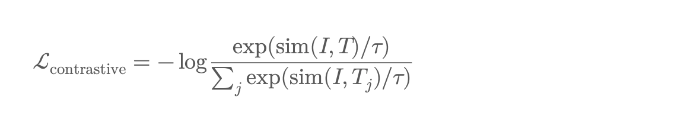

https://medium.com/@xiaxiami/how-vision-language-models-are-trained-a-deep-dive-into-the-vlm-training-process-1ba1d8704bb0

讨论类似gpt-4v,gemini,flamingo,minigpt-4等vlm模型是如何训练的，训练过程和纯语言模型或者视觉模型有什么不一样。本篇内容只讨论端到端的训练过程，包括：

- 架构overview
- vision和lang编码选择
- 数据准备
- 预训练目标
- 训练策略
- 针对下游任务的微调

### vlm model定义

同时处理图像（或视频）输入和文本输入，以学习跨模态特征。这些模型经过训练能协调处理视觉和文本模态从而处理以下任务：

- Image captioning
- visual question answering
- referring expression comprehension
- Image-text retrieval
- multimodal dialogue

### vlm架构总览

大多数vlm架构师two-tower结构或者fusion架构，包括：

1. vision encoder:把 images转换成embeddings

   - 经常的backbones:
     - viT
     - clip vit
     - convNext
     - Swin transformer
   - 举例:
     - input images->patch embedding->vit layers->visual tokens

2. llm的text encoder: 处理输入文本或者产生文本

   - 经常的选择：
     - Bert, Roberta(for non-generative models)
     - GPT-2/3,LLaMA,OPT(for generative models)
   - 举例子：
     - Text->tokenizer->embeddings->Transformer decoder

3. Cross-modal fusion module: 联系两种模态

   - 选择：
     - Cross-attention layers
     - concatenation + joint transformer
     - adapters 或者projection layers for aligning dimensions

   

   

   ### 数据准备

   1. Image-text pairs
      - LAION-400M/5B
      - Conceptual Captions(CC3M, CC12M)
      - COCO Captions
      - RedCaps
      - YFCC-100M
   2. Visual instruction data
      - 在指令调优的VLMs中使用
      - 比如LLaVA-style conversations(image + prompt ->response)
      - MiniGPT-4 prompts
      - Self-instruct data for images
   3. 合成渲染数据
      - 生成标题，基于ocr的描述或者图表
      - 帮助模型学习视觉推理

   

   ### 预训练目标 pretrainning objectives

   预训练目标取决于vlm的种类。

   1. 对比学习Contrastive Learning(CLIP-style)

      - 最大化image和text对的相似度

      - Clip, align,  blip(as a stage)

        

   2. Image-Conditioned Language Modeling 图像条件的语言建模

      - 训练text deoder根据图像特征产生captions或者问题答案
      - 举例子
        - BLIP-2
        - LLaVA
        - MiniGPT-4

   3. Masked Modeling(Multimodal MLM)。  盖住输入并进行预测

      - Masked language modeling(MLM)
      - Masked image modeling(MIM)
      - 比如：
        - ALBEF
        - UNITER

   4. 下一句话预测/匹配

      - 二分类器是否匹配
      - 这个caption描述这张图像了吗

   

   ### vlm training pipeline

   1. 初始化vision encoder
      - Vit( from clip或者dino)
      - 根据数据和算力决定Freeze/finetune
   2. 对齐模态
      - 增加投影层将image/text投影到同一个维度
      - 应用对齐损失（constative or matching）
   3. 增加cross-attention
      - 插入cross-attention从文本到语言token
      - 这使得诸如vqa之类的任务能够尽早融合
   4. 在大规模pairs进行预训练
      - 在大规模图像对上训练
      - 数十万步
      - 使用fp16/bf16和梯度检查点来减少内存占用
   5. 指导性的调整(optional)
      - 将图像和prompt喂到模型中
      - 训练产生合适的文本response

   

   ### 关键实现细节

   ##### positional embeddings

   - 为image patches 和text tokens分别使用学习性/sinusoidal位置编码
   - 相对位置编码提高了灵活性

   ##### image tokenization

   - 图像被分割成图像块（vit）或者tokens（vq-vae）
   - 另一种方法：使用object detector的区域特征（比如visualBERT）

   ### training tricks

   - 课程学习Easy->to->hard，先学简单的再学复杂的
   - 混合数据集和特定任务损失权重，不同数据集权重不同
   - 标题质量过滤

   

   

   
